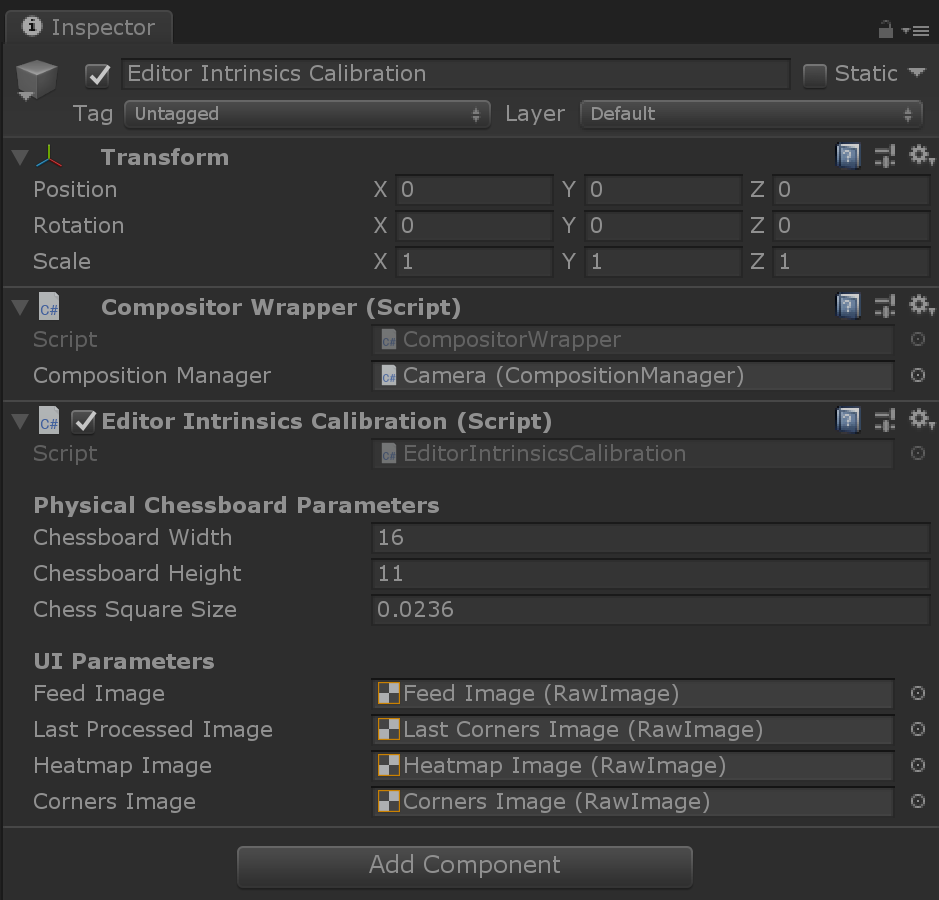
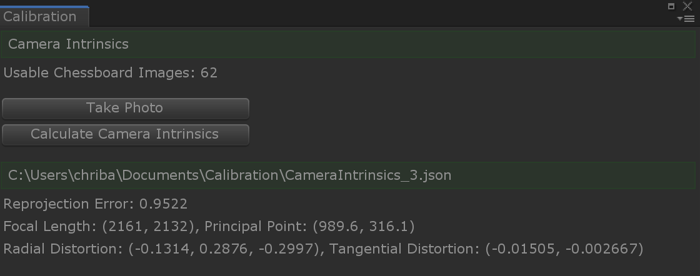
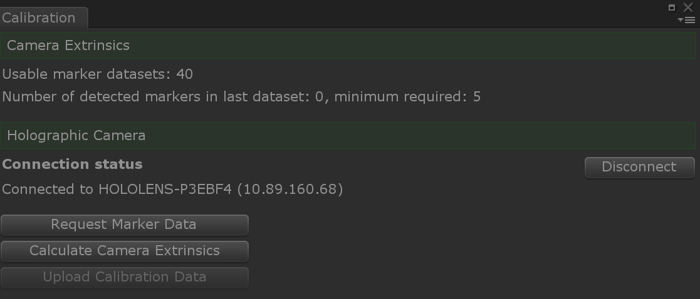
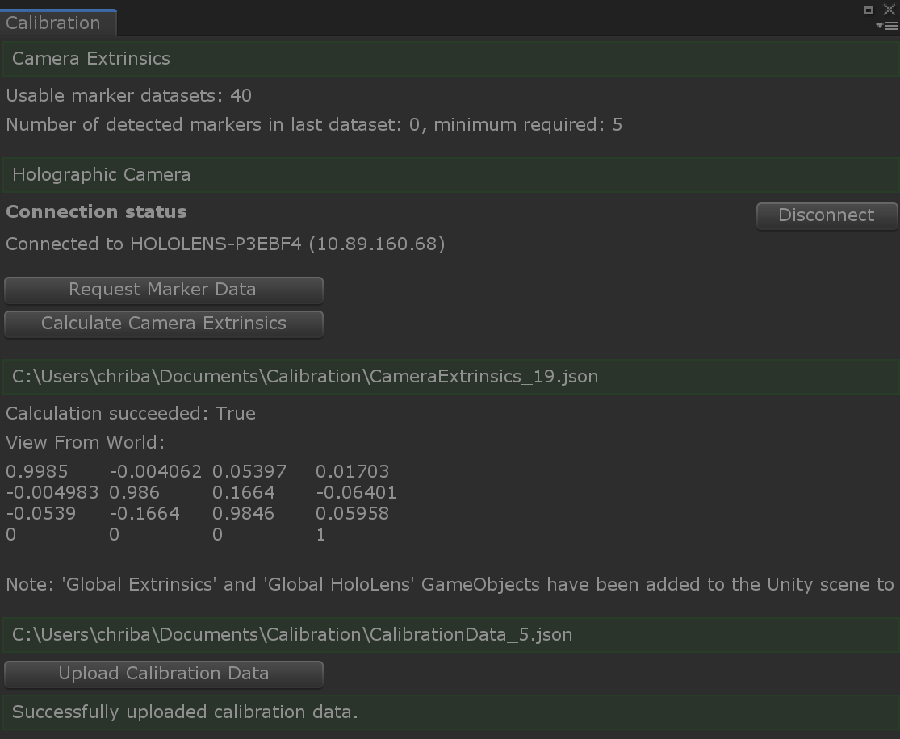

# Requirements

> Note: DSLR Filming currently requires a HoloLens 2 for the camera rig. HoloLens 1 devices are not supported.

1. HoloLens 2 (This device will be needed in addition to the user worn device)
2. Windows PC
3. Visual Studio 2017 installed on the PC
4. Windows 10 SDK (10.0.18362.0)
5. Unity installed on the PC
6. A DSLR camera
7. A Blackmagic Design or Elgato capture card
8. HoloLens 2 Camera Mount (Coming soon...)

# Calibration

## Setup

1. Build x64 Release versions of SpectatorView.Compositor.dll & SpectatorView.Compositor.UnityPlugin.dll based on the instructions [here](../src/SpectatorView.Native/ReadME.md).
2. Build a x64 Release version of SpectatorView.OpenCV.dll based on the instructions [here](../src/SpectatorView.Native/ReadME.md).
3. Copy these Dlls to the SpectatorView.Unity project by running [CopyPluginsToUnity.bat](../tools/Scripts/CopyPluginsToUnity.bat).
4. Download the [MixedReality QR Code Plugin](https://github.com/dorreneb/mixed-reality/releases) zip folder and extract its contents into the [MixedReality-QRCodePlugin folder](../external/MixedReality-QRCodePlugin).
5. Print the [Chessboard]() used to calculate DSLR camera intrinsics and mount it to a solid surface.
6. Print the [Calibration Board](images/CalibrationBoard.png) used to calculate DSLR camera extrinsics and mount it to a solid surface.

This [Calibration Board](images/CalibrationBoard.png) contains 18 QR Codes and ArUco markers pairs that are at known pixel distances from one another. With these marker pairs, calibration logic can use QR Code detection on the HoloLens 2 and ArUco detection in the editor to determine where ArUco markers in the DSLR camera frame are in the physical world. **When printing this board, markers need to be larger than 5cm in length. It's also important to keep these marker pairs on the same page when printing so that their pixel distances from one another are maintained. The orientation of these pairs relative to other pairs does not need to be maintained (meaning, each marker pair can get printed on its own sheet of paper, but both the QR Code and ArUco marker in a pair should be printed on the same page at the same relative distance that they are at in the board).**

7. On your HoloLens 2 device, disable sign in. This can be achieved by going to 'Settings -> Sign-in options'. For 'Require sign-in', select 'Never'.

8. Setup the [device portal](https://docs.microsoft.com/en-us/windows/uwp/debug-test-perf/device-portal-hololens) for your HoloLens 2 device. To see how to setup device portal, look [here](https://docs.microsoft.com/en-us/windows/uwp/debug-test-perf/device-portal-hololens).

9. Connect your HoloLens 2 to Wi-Fi and obtain its IP address. This can be done through the settings application on the device. Go to Settings -> Network & Internet -> Wi-Fi -> Hardware properties to obtain the device's IP address.
10. Deploy the HolographiCamera.Unity project to your HoloLens 2 device.
    1. Open the HolographicCamera.Unity project.
    2. Open the HolographicCamera Unity scene in the project.
    3. In the WSA Unity player settings, add the **QRCODESTRACKER_BINARY_AVAILABLE** preprocessor directive. (This is located via Build Settings -> Player Settings -> Other Settings -> 'Scripting Defined Symbols
    4. Build and deploy this project to your HoloLens 2 device.

11. Test QR Code detection in the SpectatorView.HolographicCamera app deployed in step 7.
    1. Build and Deploy the SpectatorView.HolographicCamera app to your device (see step 7).
    2. Open the SpectatorView.Example.Unity project.
    3. Open the SpectatorView.ExtrinsicsCalibration Unity scene.
    4. Open the Calibration window in the Unity Editor. This can be found in the toolbar under 'Spectator View' -> 'Calibration'.
    5. Run the SpectatorView.ExtrinsicsCalibration Unity scene in the editor.
    6. Connect to your HoloLens 2 device by specifying its IP address in the Holographic Camera text field and pressing 'Connect'.
    7. Press 'Request Marker Data' to kick off QR Code detection.
    8. View your printed [Calibration Board](images/CalibrationBoard.png) through the HoloLens 2 device and make sure that blue and green squares appear over the QR Codes and ArUco markers (This may require getting the HoloLens 2 extremely close to the calibration board. 5cm QR Codes need to be detected from a distance of 10cm).

12. Attach your DSLR camera to the PC capture card and insure that the camera stream works.
    1. Attach your DSLR camera by HDMI or SDI to the capture card hooked up to your PC.
    2. Turn on your DSLR camera.
    3. Open the SpectatorView.Example.Unity project.
    4. Open the SpectatorViewCompositor Unity scene in the Unity Editor.
    5. Open the Compositor window in the Unity Editor. This can be found in the toolbar under 'Spectator View' -> 'Compositor'.
    6. Run the SpectatorViewCompositor scene in the Unity Editor.
    7. You should see the Camera Feed appear in the Compositor window if everything has been configured correctly.

13. Attach your HoloLens 2 device to the DSLR Camera using the HoloLens 2 camera mount (Coming soon...)

## Camera Intrinsics

Camera intrinsics quantify focal lengths, principal points and lens distortion information for your DSLR Camera. For DSLR Filming, camera intrinsics are used to calculate the Unity camera's projection matrix for the Hologram feed. This then allows the Hologram feed to be composited with the DSLR camera feed. For more information on camera intrinsics, see [here](https://en.wikipedia.org/wiki/Camera_resectioning).

>Note: Changing the zoom and focus length of your DSLR camera's lens will change the camera intrinsics. When conducting calibration, you should change your lens to its manual focus setting. You should also avoid using the manual focus ring when obtaining images. Although images may at times appear blurry, as long as the 

1. Open the SpectatorView.Example.Unity project.
2. Open the Calibration window in the Unity Editor. This can be found in the toolbar under 'Spectator View' -> 'Calibration'.
3. Open the SpectatorView.IntrinsicsCalibration Unity scene.
4. Update the Editor Intrinsics Calibration serialized fields in the Unity Inspector.

You will need to update the Chessboard Width, Chessboard Height and Chess Square Size values to reflect the Chessboard print that you obtained during setup.

5. Run the SpectatorView.IntrinsicsCalibration Unity scene in the Unity Editor.
6. Begin taking photos of the Chessboard with your DSLR camera through the Unity Editor. To capture a photo Either press 'Take Photo' in the calibration window or select the 'Game' window and press 'Space' on your keyboard.

For each obtained image, EditorIntrinsicsCalibration will attempt to detect the chessboard. If the chessboard is found, it will be displayed in the detected chessboard image on the screen. The 'Usable Chessboard Images' count in the Calibration window will also be incremented.

7. Continue obtaining images until you have obtained a sufficient number of chessboard feature points. Each image where the chessboard is detected will result in (Chessboard Width - 1) x (Chessboard Height - 1) feature points. You can obtain better calibration results by obtaining more chessboard feature points at different locations. You also want to have an even distribution of chessboard feature points throughout the DSLR camera frame. The distribution of chessboard feature points can be observed based on Chessboard Heatmap and Chessboard Corners images that are also shown in the Unity scene. Example of Chessboard Heatmap and Chessboard Corners with even distribution are shown below.

Chessboard Heatmap

Chessboard Corners

8. After obtaining enough Chessboard feature points, Press 'Calculate Camera Intrinsics' in the Calibration window or 'Enter' on your keyboard to calculate camera intrinsics.

>Note: Calculating camera intrinsics may take a while and take control of the UI thread for the Unity Editor.

9. Locate the output CameraIntrinsics*.json file on your computer. This file, as well as the images used to calculate camera intrinsics should be located in a 'Calibration' folder within your 'Documents' folder.

## Camera Extrinsics
1. Open the SpectatorView.Example.Unity project.
2. Open the Calibration window in the Unity Editor. This can be found in the toolbar under 'Spectator View' -> 'Calibration'.
3. Open the SpectatorView.ExtrinsicsCalibration Unity scene.
4. Update the Editor Extrinsics Calibration serialized fields in the Unity Inspector.

You will need to set the Camera Intrinsics Path to the CameraIntrinsics*.json file that you created in the previous Camera Intrinsics steps.

5. Run the SpectatorView.ExtrinsicsCalibration Unity scene in the Unity Editor.
6. Launch the SpectatorView.HolographicCamera app on your HoloLens 2 device through the device portal.
7. Specify your device's IP address in the Calibration window and press connect.

8. After connecting your device, press 'Request Marker Data' in the calibration window or press 'Space' on your keyboard when the Unity 'Game' window is in focus. This will kick off QR Code detection.

9. Take your HoloLens 2 and DSLR Camera rig and and detect all of the QR Codes on your printed Calibration Board. This may require getting the HoloLens 2 device close to the QR Codes. To determine whether all of the QR Codes have been detected, connect to your device through the device portal. Then, view the Mixed Reality Capture stream until green and blue squares have been placed over the QR Code and ArUco markers on the Calibration Board. This may require placing the HoloLens 2 device super close to the Calibration Board.

>Note: QR Code detection requires that the QR Codes are larger than 5cm. If the QR Codes are smaller than 5cm in length, you will need to reprint a larger board.

After detecting all of the markers, make sure the entire Calibration Board can be seen in the DSLR camera stream. Then press 'Request Marker Data' or press the 'Space' key to obtain marker information from the HoloLens 2 device. The 'Usable marker datasets' count should be incremented. You can also see how many markers were detected in the last dataset relative to the minimum number of markers that are required for a dataset to be deemed usable.

10. After obtaining multiple marker datasets and Calibration Board images, press 'Calculate Camera Extrinsics' or the 'Enter' key when the Game window is in focus to calculate the camera extrinsics.

11. Look in the Calibration window to see whether or not the calculation succeeded. If the calculation did succeed, you can choose to upload your calibration file to the device by pressing 'Upload Calibration Data'.

>Note: Uploading calibration data to your device will overwrite any previously existing calibration data on the device. CalibrationData.json is stored in the Pictures Library on the HoloLens 2 device and can be manually managed through Device Portal's File Explorer. DO NOT press 'Upload Calibration Data' if you already have valid calibration data on your device and do not want to overwrite it.

12. After uploading a CalibrationData.json file to your HoloLens 2 device's Picture Library, you have completed calibration and can begin filming. However, calibration can generate varying results. It's suggested to test your calibration to ensure it achieves the quality required for your filming needs. Multiple calibration attempts may be required to obtain adequate results.

## Testing Calibration
Coming soon...

## Tips for Calibrating
Coming soon...

# Filming
Coming soon...