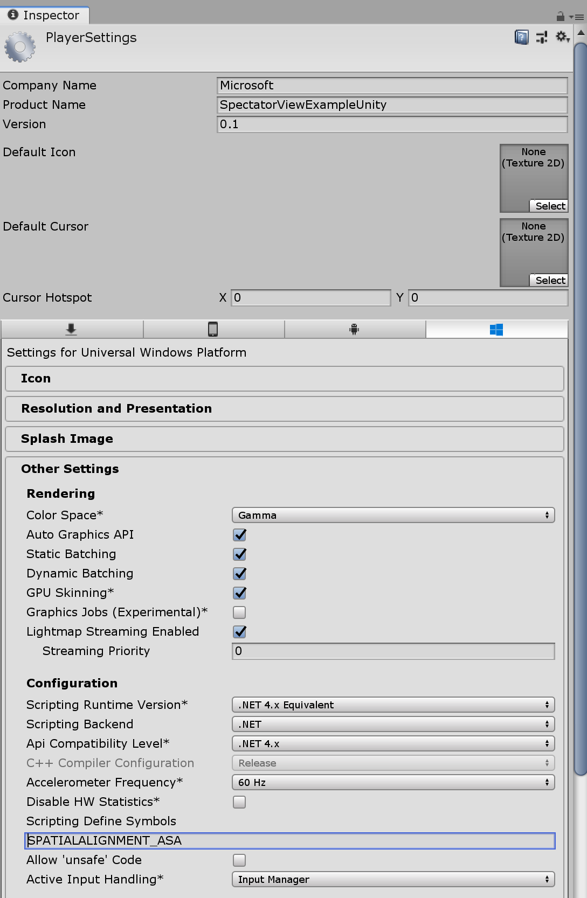
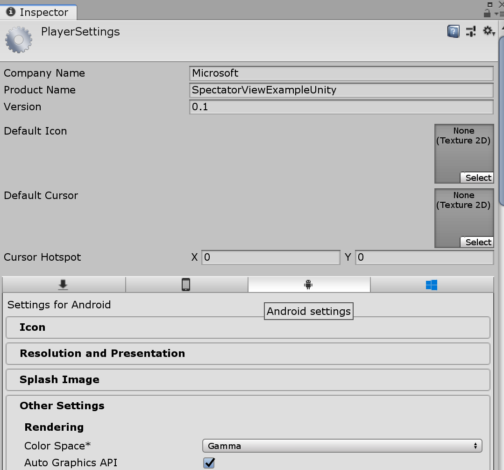
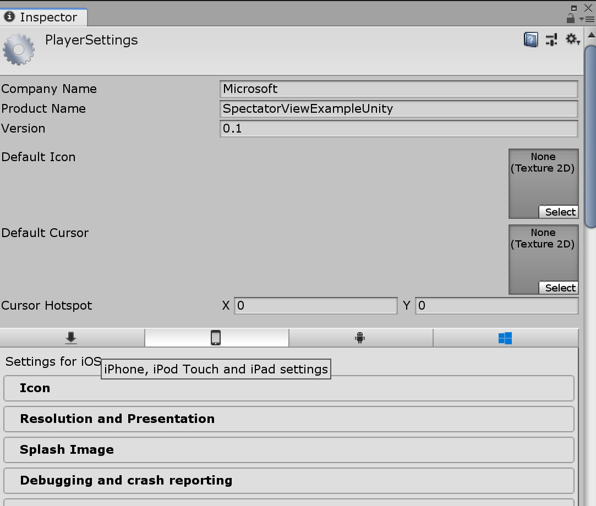
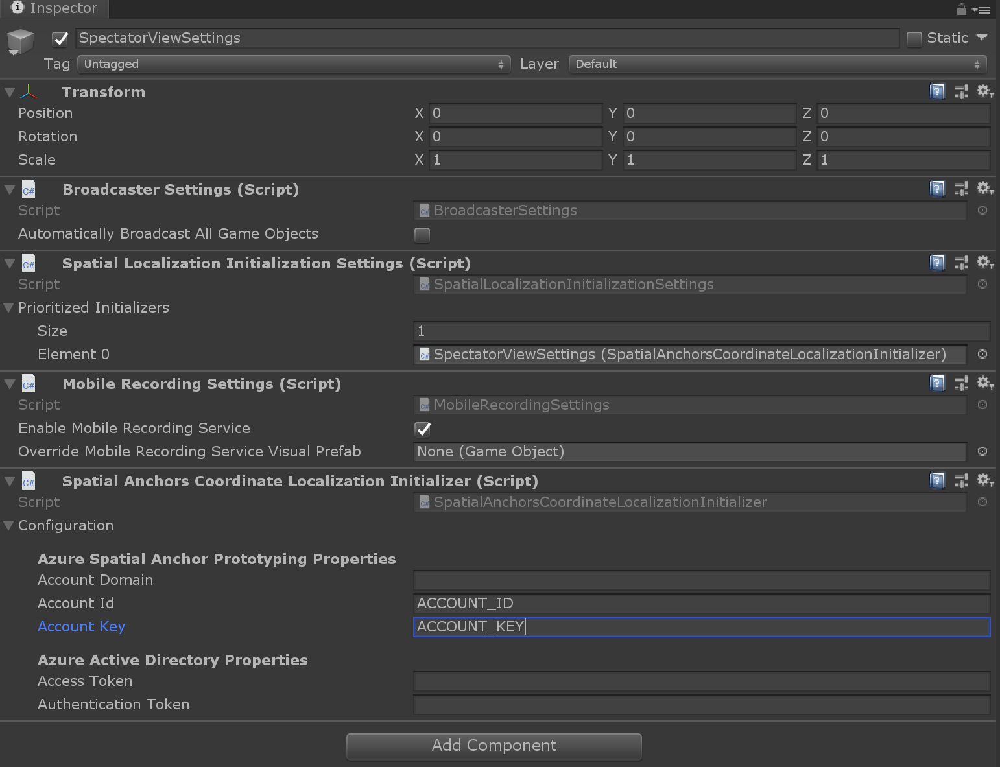
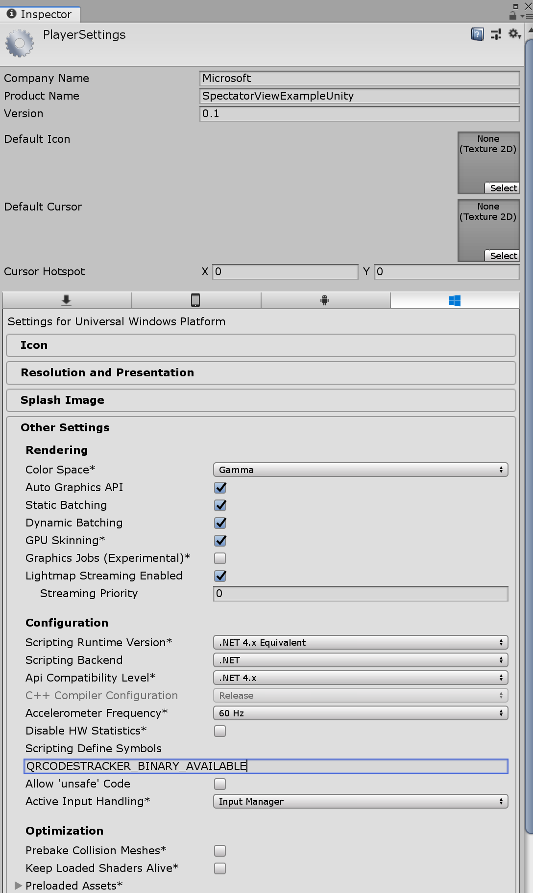
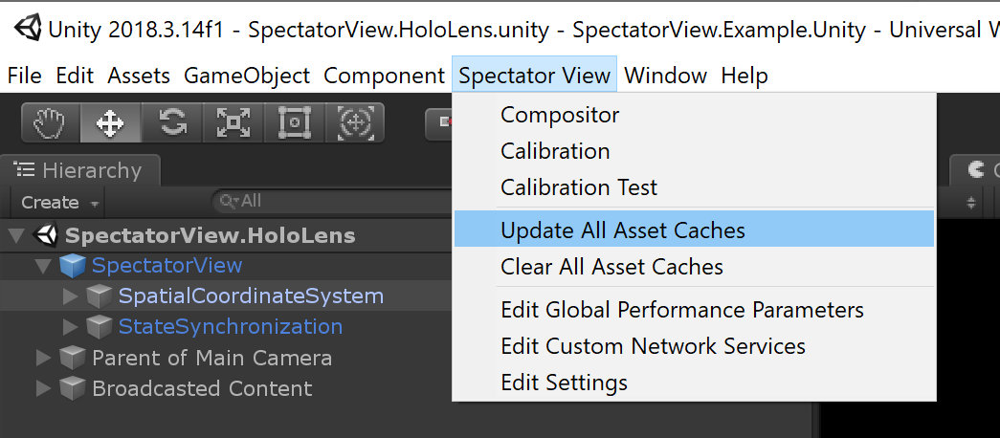
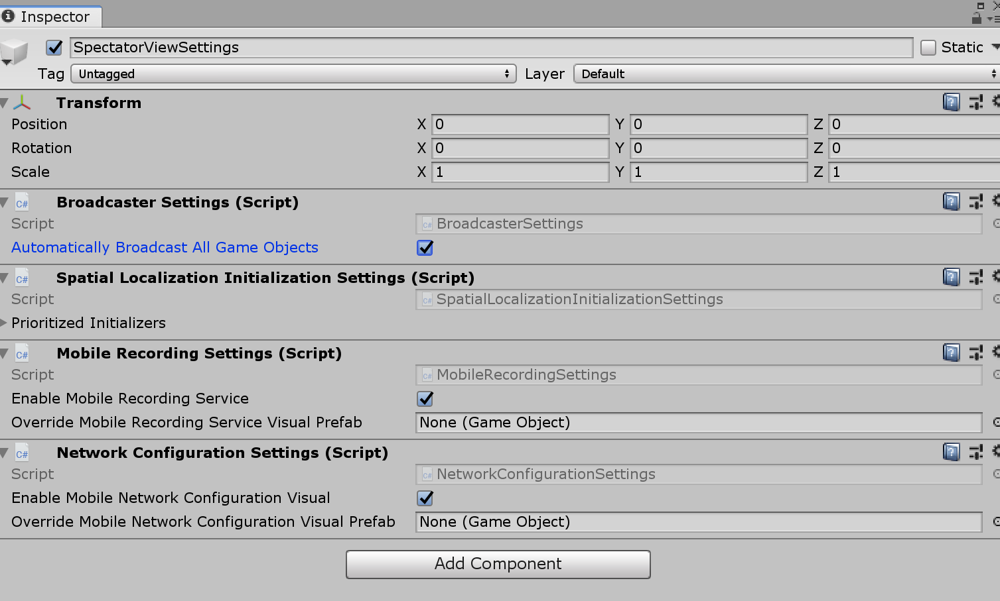
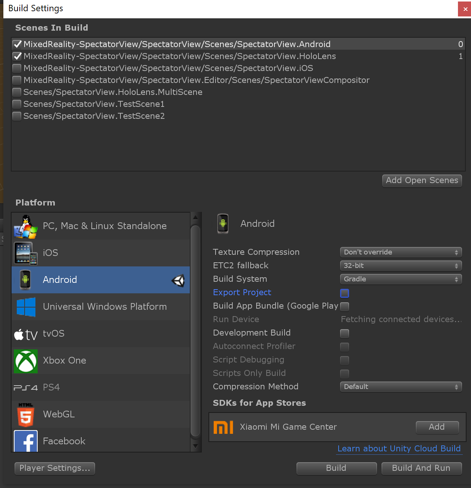
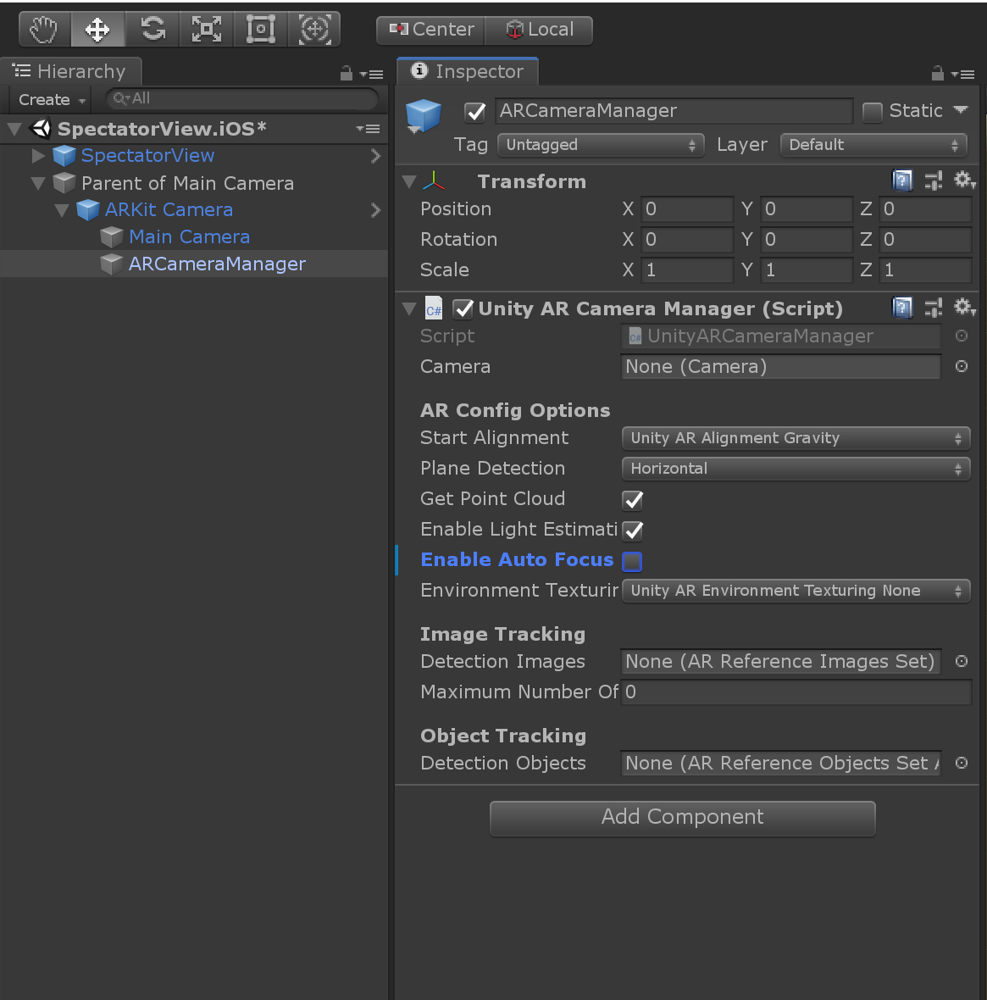
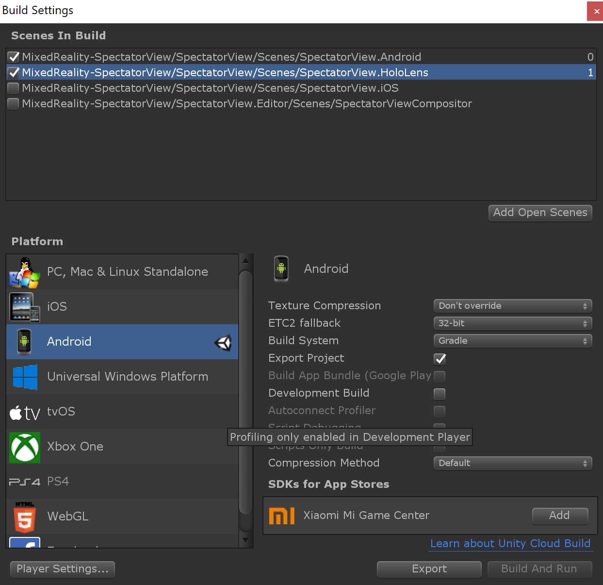

# Spectator View Mobile Setup
To setup spectator view with a video camera, see [here](SpectatorView.Setup.VideoCamera.md).

## Software & Hardware Requirements

>Note: Spectator View does not currently support Unity's [ARFoundation package](https://docs.unity3d.com/Packages/com.unity.xr.arfoundation@1.0/manual/index.html). For Android and iOS experiences, Spectator View requires using ARCore and ARKit.

### HoloLens 2 & HoloLens Requirements

1. Windows PC
2. HoloLens 2 or HoloLens
3. [Visual Studio 2017](https://visualstudio.microsoft.com/vs/) installed on the PC
4. [Windows 10 SDK (10.0.18362.0)](https://developer.microsoft.com/en-us/windows/downloads/windows-10-sdk)
5. [Unity](https://unity3d.com/get-unity/download) installed on the PC

### Android Requirements

1. Windows PC
2. Android Device that supports [AR Core](https://developers.google.com/ar/discover/supported-devices)
3. [Android Studio](https://developer.android.com/studio)
4. Obtain [ARCore v1.7.0](https://github.com/google-ar/arcore-unity-sdk/releases/tag/v1.7.0) (Note: only v1.7.0 has been tested, use other versions at your own risk). This can be achieved by running the `tools/Scripts/SetupRepository.bat` script as an administrator or by manually copying assets content into a ARCore-Unity-SDK folder in the external directory.
5. [Unity](https://unity3d.com/get-unity/download) installed on your development device with [Android build support](https://docs.unity3d.com/Manual/android-sdksetup.html). This module can be included when first installing Unity, or you can use [Unity Hub to add the module](https://docs.unity3d.com/Manual/GettingStartedAddingEditorComponents.html) after installing.
6. If building with IL2CPP, a specific Android NDK may be required (Unity 2018.3.14f1 required r16b). Older NDK's can be found [here](https://developer.android.com/ndk/downloads/older_releases.html).

>Note: ARCore does not share MixedReality-SpectatorView's MIT license. For more information on ARCore licensing, see [here](https://github.com/google-ar/arcore-unity-sdk/blob/master/LICENSE).

### iOS Requirements

>Note: ARKit contains some scripts that will generate build failures for HoloLens builds. You will only need to obtain the ARKit Unity Plugin described below on your mac device.

1. Mac
2. ARM64 iOS Device that supports [AR Kit](https://developer.apple.com/library/archive/documentation/DeviceInformation/Reference/iOSDeviceCompatibility/DeviceCompatibilityMatrix/DeviceCompatibilityMatrix.html)
3. [Unity](https://unity3d.com/get-unity/download) installed on the Mac with [iOS build support](https://docs.unity3d.com/Manual/iphone-GettingStarted.html).  This module can be included when first installing Unity, or you can use [Unity Hub to add the module](https://docs.unity3d.com/Manual/GettingStartedAddingEditorComponents.html) after installing.
4. [XCode](https://developer.apple.com/xcode/) installed on the Mac
5. Obtain an [apple developer license](https://developer.apple.com/programs/enroll/)
6. Obtain [Unity's ARKit Plugin](https://bitbucket.org/Unity-Technologies/unity-arkit-plugin/src/default/) and place it within the `external/ARKit-Unity-Plugin` folder.

>Note: Unity's ARKit Plugin has two licenses, one of which is not a MIT license. For more information on ARKit licensing, see [here](https://bitbucket.org/Unity-Technologies/unity-arkit-plugin/src/default/LICENSES/).

# Preparing your project

To use the Spectator View codebase, its suggested to clone and reference the MixedReality-SpectatorView repository through symbolic linked directories in your Unity project. Before beginning on the steps below, go through the repository setup process [here](../README.md). This will ensure that the Unity editor components referenced below exist in your project.

## Spatial Alignment Strategy Dependencies

Spectator View requires multiple devices understanding a shared application origin in the physical world. In order to establish this shared application origin, you will need to choose and use a [spatial alignment strategy](../src/SpectatorView.Unity/Assets/SpatialAlignment/README.md). You will only need to go through one setup process below for the spatial alignment strategy you choose.

Not all spatial alignment strategies support all platforms. See the chart below to determine which strategy best addresses your intended user scenarios.

| Platform  Support      | HoloLens 2 | HoloLens 1 | Android | iOS |
|:----------------------:|:----------:|:----------:|:-------:|:---:|
| Azure Spatial Anchors  | x          | x          | x       | x   |
| QR Code Detection      | x          |            | x       | x   |
| ArUco Marker Detection |            | x          | x       | x   |

### Azure Spatial Anchors

1. Setup an [Azure Spatial Anchors account](https://docs.microsoft.com/en-us/azure/spatial-anchors/quickstarts/get-started-unity-hololens) and obtain an `Account ID` and `Primary Key`.
2. Obtain [AzureSpatialAnchors v1.1.1](https://github.com/Azure/azure-spatial-anchors-samples/releases/tag/v1.1.1). This can be achieved by running the `tools/Scripts/SetupRepository.bat` script as an administrator or by manually copying assets content into the `external/Azure-Spatial-Anchors-Samples` folder.
3. Add the `SPATIALALIGNMENT_ASA` preprocessor directive to your **Universal Windows Platform Player Settings** (This is located via Build Settings -> Player Settings -> Other Settings -> 'Scripting Defined Symbols')

4. Add the `SPATIALALIGNMENT_ASA` preprocessor directive to your **Android Player Settings** (This is located via Build Settings -> Player Settings -> Other Settings -> 'Scripting Defined Symbols'). **Be sure to pick the Android tab in the Player Settings.**

> Note: If the Android Player Settings don't exist as an option, you may need to install the Android Build tools for Unity. For instructions on how to do this, see [here](https://docs.unity3d.com/Manual/GettingStartedAddingEditorComponents.html).

5. Add the `SPATIALALIGNMENT_ASA` preprocessor directive to your **iOS player settings** (This is located via Build Settings -> Player Settings -> Other Settings -> 'Scripting Defined Symbols').  **Be sure to pick the iOS tab in the Player Settings.**

>Note: If the iOS Player Settings don't exist as an option, you may need to install the iOS Build tools for Unity. For instructions on how to do this, see [here](https://docs.unity3d.com/Manual/GettingStartedAddingEditorComponents.html).

6. Create a `SpectatorViewSettings` prefab by calling 'Spectator View' -> 'Edit Settings' in the toolbar.

7. Add a `SpatialAnchorsCoordinateLocalizationInitializer` to this SpectatorViewSettings prefab. Update the Account ID and Account Key to be the Account ID and Primary Key values that you obtained in step 1. 
8. Update the `SpatialLocalizationInitializationSettings` Prioritized Initializers list to reference the `SpatialAnchorCoordinateLocalizationInitializer` you created.

> Note: Use of an Account Id and Account Key can accelerate your development process. However, hardcoding these values into your application isn't a safe practice and should be avoided for enterprise deployed solutions. For your end application, its suggested to use an Access or Authentication token. More information on how to setup and use AAD tokens with ASA can be found [here](https://docs.microsoft.com/en-us/azure/spatial-anchors/concepts/authentication?tabs=csharp#azure-ad-user-authentication).

#### Azure Spatial Anchors on iOS
If you are building Azure Spatial Anchors on iOS, you will need to take some additional steps after generating your XCode project through Unity. After exporting an iOS version of your application in Unity, do the following:

1. In the terminal, navigate to your xcode project folder.
2. Run `'pod install --repo-update'` in the terminal when in your xcode project folder.
3. Open and compile your application using the **xcode workspace**. Do NOT use the **xcode project**.
> Note: Failing to take the above steps may result in errors such as 'Undefined symbols for architecture arm64' and 'framework not found Pods_Unity_iPhone' For more information on building ASA for iOS in Unity see [here](https://docs.microsoft.com/en-us/azure/spatial-anchors/quickstarts/get-started-unity-ios).

### QR Code Detection

1. Download the QR APIs Nuget Package [releases.zip](https://github.com/dorreneb/mixed-reality/releases/tag/1.1) folder and extract its contents into the `external/MixedReality-QRCodePlugin` folder.
2. Build an x86 Release version of [SpectatorView.WinRTExtensions.dll](../src/SpectatorView.Native/README.md) and include the associated dll's in your Unity project. Adding the plugins to your Unity project can be achieved by running the `tools/Scripts/CopyPluginsToUnity.bat` script.
3. In the WSA Unity player settings, add the `QRCODESTRACKER_BINARY_AVAILABLE` preprocessor directive. (This is located via Build Settings -> Player Settings -> Other Settings -> 'Scripting Defined Symbols')

### ArUco Marker Detection

1. Build an x86 Release version of SpectatorView.OpenCV.dll and SpectatorView.WinRTExtensions.dll (see instructions [here](../src/SpectatorView.Native/README.md)) and include the associated dll's in your Unity project. 

2. Add the plugins to your Unity project by running the `tools/Scripts/CopyPluginsToUnity.bat` script. This will add an empty SpectatorView.OpenCV.dll (and dependencies) for the ARM build flavor, which prevents HoloLens 2 build errors.

## Building & Deploying

### Before Building

1. Obtain your HoloLens's ip address from its windows settings menu via Settings -> Network & Internet -> Wi-Fi -> Hardware Properties.
2. Add any of the preprocessor directives or Unity packages described above that you intend to use to your clone of the SpectatorView codebase.
3. If you would like to synchronize Text Mesh Pro UI, you will need to add the `STATESYNC_TEXTMESHPRO` preprocessor directive to the UWP, iOS and Android Player Settings (This is located via Build Settings -> Player Settings -> Other Settings -> 'Scripting Defined Symbols').
4. Open the `SpectatorView.HoloLens` scene in your Unity project.
5. In the Unity editor, call 'Spectator View -> Update All Asset Caches' (This will be located in the Unity editor toolbar) to prepare content for state synchronization. Add the Generated.StateSynchronization.AssetCaches folder to your project's repository to share across development devices.

6. Edit the state synchronization performance parameters in your application to monitor material property changes based on your applications needs (SpectatorView -> Edit Global Performance Parameters). For more information on performance tuning content synchronization, see [here](../src/SpectatorView.Unity/Assets/SpectatorView/Scripts/StateSynchronization/README.md).

> Note: **Asset Caches need to be updated on one development machine and shared across development machines**. Asset Caches aren't currently created in a deterministic manner and can't be recreated in new development environments. The easiest way to share this with a team is to commit changes to the Generated.StateSynchronization.AssetCaches folder that will appear in the Unity project's Assets directory. For more information on Asset Caches see [SpectatorView.StateSynchronization](../src/SpectatorView.Unity/Assets/SpectatorView/Scripts/StateSynchronization/README.md).

### HoloLens 2 & HoloLens

1. Make sure your Unity project contains the asset caches that were created in the 'Before building' steps.
2. Open the project scene that you intend to use with SpectatorView. (**Note:** For spectating with a HoloLens device, use `SpectatorView.HoloLens.Spectator` scene.)
3. Add the `SpectatorView` prefab to the scene.
4. Setup your scene to synchronize content. You can either have all content synchronized by checking 'Automatically Broadcast All Game Objects' in BroadcasterSettings located in your SpectatorViewSettings prefab. Or, you can manually add GameObjectHierarchyBroadcaster components to all parent game objects in the scene that you want synchronized.

5. Press the 'HoloLens' button on the `Platform Switcher` attached to `Spectator View` in the Unity inspector (This should configure the correct build settings and app capabilities).
6. Build and deploy the application to your HoloLens device.

### Android

1. Make sure your Unity project contains the asset caches that were created in the 'Before building' steps.
2. Make sure that you have a reference to ARCore v1.7.0 in your project. This can be achieved by running the `tools/Scripts/SetupRepository.bat` script as an administrator or by downloading and importing the package from [ARCore v1.7.0](https://github.com/google-ar/arcore-unity-sdk/releases/tag/v1.7.0).
3. Open the `SpectatorView.Android` Unity scene.
4. Press the 'Android' button on the `Platform Switcher` attached to `Spectator View` in the Unity inspector (This should configure the correct build settings, app capabilities, and make sure you have a valid Android manifest file).

> Note: If you need to customize your Android manifest, you can make changes to `Assets/Plugins/Android/AndroidManifest.xml` before you build, or you can use the 'Export Project' build option in Unity and then edit `src/main/AndroidManifest.xml` in your Android Studio project.

5. Make sure to declare the SpectatorView.Android scene as the scene included. If SpectatorView.Android does not exist in your list of scenes to choose from in the build settings, open the scene in the Unity editor. Then reopen the build settings and press 'Add Open Scenes'.

6. `Build and Run` the application through Unity's Build Settings. If you're targeting a new Android development device, you may need to enable developer options and debugging. For information on setting up your Android device for debugging, see [here](https://developer.android.com/studio/debug/dev-options).

### iOS

> Note: Building iOS applications requires a mac.

1. Make sure your Unity project contains the asset caches that were created in the 'Before building' steps. Asset caches can't be recreated in new development environments, so the asset caches created on the PC need to be checked in or copied over to your mac development environment.
2. Import [Unity's ARKit Plugin](https://bitbucket.org/Unity-Technologies/unity-arkit-plugin/src/default/) to your Unity project. To do this, download the source code from the provided link. You can then add the source code to the `external/ARKit-Unity-Plugin` folder. The `tools/Scripts/AddDependencies.bat` script should have added a symbolic link to this folder to your project when setting things up.
3. Open the `SpectatorView.iOS` Unity scene.
4. Press the 'iOS' button on the `Platform Switcher` attached to `Spectator View` in the Unity inspector (This should configure the correct build settings and app capabilities).
5. Export the iOS project to a XCode solution. Be sure to include the SpectatorView.iOS scene. If SpectatorView.iOS scene does not exist in your list of scenes to choose from in the build settings, open the scene in the Unity editor. Then reopen the build settings and press 'Add Open Scenes'.
6. Configure the [signing certificate](https://developer.apple.com/support/code-signing/) for your Unity generated project in XCode to reflect your developer account.
7. Build and deploy the application through XCode to your desired device (See the below steps if using ASA).

#### iOS with Azure Spatial Anchors
1. In the terminal, navigate to your xcode project folder.
2. Run `'pod install --repo-update'` in the terminal when in your xcode project folder.
3. Open and compile your application using the **xcode workspace**. Do NOT use the **xcode project**.
>Note: Failing to take the above steps may result in errors such as 'Undefined symbols for architecture arm64' and 'framework not found Pods_Unity_iPhone' For more information on building ASA for iOS in Unity see [here](https://docs.microsoft.com/en-us/azure/spatial-anchors/quickstarts/get-started-unity-ios).

## Example Scenes

If you would like to try out an example before setting up your own application to work with spectator view, run `tools/Scripts/SetupRepository.bat` as an administrator. Then, open the `samples/SpectatorView.Example.Unity` project. You can then build and deploy the following scenes:

* HoloLens Host: `SpectatorView.HoloLens`
* HoloLens Spectator: `SpectatorView.HoloLens.Spectator`
* Android: `SpectatorView.Android`
* iOS: `SpectatorView.iOS`

## Customizing UI

Spectator View contains some ability for customizing UI. For more information, see [here](../src/SpectatorView.Unity/Assets/SpectatorView/Scripts/UI/README.md).

## Troubleshooting

### __Issue:__ DirectoryNotFoundException: Could not find a part of the path "*.asmdef"
Spectator view uses symbolic linked directories in its sample projects, which results in large file paths. A DirectoryNotFoundException can occur if these file paths become too long. To fix this, place your Unity project in a directory with a shorter name, such as c:\proj.

### __Issue:__ Android screen recording fails to begin based on PERMISSION_DENIED
In some instances, contributors have experienced issues with android permissions after exporting their Unity project to Android Studio and declaring the ScreenRecordingActivity as their main activity in the AndroidManifest.xml. It's been observed that `android:maxSdkVersion=18` arguments can appear in the exported solution for the WRITE_EXTERNAL_STORAGE and READ_EXTERNAL_STORAGE user-permissions declared in their AndroidManifest. Removing `maxSdkVersion` declarations has unblocked users and allowed screen recording to work.

### __Issue:__ System.* types fail to resolve when first building a HoloLens visual studio solution generated from Unity
When first opening a visual studio solution generated from Unity for the Spectator View codebase, the build may fail. Typically after this first failure, an `Opening repositories` step will run and output to the visual studio console. Reattempting the build after this step has ran typically results in the solution succeeding to compile.

### __Issue:__ SetupRepository.sh did not work on Mac
Depending on your local environment, you may need to declare the SetupRepository.sh script as executable by changing its access permissions/mode. To do this, run the following commands:
- `cd tools/Scripts`
- `chmod a+x *.sh`
- `./SetupRepository.sh`

### __Issue:__ Unity fails to open your SpectatorView project on Mac
You may encounter issues when opening a Unity project based on read/write permissions for Project Packages. To fix this, you can run the following command in your Project's Packages folder (Note the below example is for the Build 2019 sample application):
- MixedReality-SpectatorView/samples/Build2019Demo.Unity/Packages$ `sudo chmod a+rwx *`

### __Issue:__ "Failed to change file flags" errors encountered when opening a Unity project on Mac
In some instances, file permissions may generate errors when opening a spectator view Unity project. To fix this, you can try running the following command:
- MixedReality-SpectatorView$ `sudo chmod a+rwx *`

### __Issue:__ Screen Recording UI won't appear on iOS device
The ARKit Camera has an Enable Auto Focus feature that consumes touch input events, breaking Unity canvas interactions on iOS. This can cause the Screen Recording UI to fail to show. To fix this, uncheck the `Enable Auto Focus` option for ARKit's `UnityARCameraManager`:

### __Issue:__ Build errors occur when `STATESYNC_TEXTMESHPRO` is enabled
In some instances, if your project does not use Unity 2018.3.14f1, you may encounter breaks in TextMeshPro state synchronization code. In most instances, you will need to make small, often type, fixes to get TextMeshPro synchronization correctly. For now, Spectator View supports Unity 2018.3.14f1 and the TextMeshPro code in the state synchronization code base will be built based off of the TextMeshPro packages shipped with Unity 2018.3.14f1.

### __Issue:__ Azure Spatial Anchors session fails to initialize on Android
Azure spatial anchors uses a custom gradle file, `mainTemplate.gradle`, in order to obtain external dependencies. Prior to release/1.0.3, helper scripts did not correctly setup the symbolic link required to include `mainTemplate.gradle` for new projects. Without this gradle file, initializing Azure Spatial Anchors will fail. To fix this issue, check in your project for `Assets/Plugins/Android/mainTemplate.gradle`. If it does not exist create a symbolic link or copy `mainTemplate.gradle` into an `Assets/Plugins/Android` folder in your Unity project. If this gradle file is in a nested Plugins folder (Not `Assets/Plugins/Android`), it may fail to get picked up correctly. You can test whether the correct gradle file was used by looking in your `build.gradle` definition within Android Studio. It should contain content similar to the `mainTemplate.gradle` distributed with the Azure Spatial Anchors submodule dependency.

### __Issue:__ Frame rate for HoloLens device drastically drops when a spectator device connects to the experience.
Scraping the entire Unity scene for content updates on the HoloLens device can be computationally expensive. You may find that you need to better tune your synchronization story to improve the overall experience. For information on how to tune your synchronization experience for better performance, see [here](../src/SpectatorView.Unity/Assets/SpectatorView/Scripts/StateSynchronization/README.md).

### __Issue:__ Transparent objects display incorrectly on Android or iOS devices.
Its been observed that different shader variants may not get correctly built into Android and iOS applications when only including the SpectatorView.Android or SpectatorView.iOS scene. For example, the standard shader may not end up with transparent variants included in the Android/iOS builds, causing transparent content to not display correctly on spectator devices. To fix this, its suggested to include your HoloLens scene in the Android/iOS build. You can do this by including the scene in your build settings (see below). Note that you will need to keep the SpectatorView.Android or SpectatorView.iOS scene has scene 0 in the build. You may also be able to fix this by including your desired shader in the Build-in Shader Settings (Edit -> Project Settings -> Graphics). You may also be able to fix this by creating a [ShaderVariantCollection](https://docs.unity3d.com/Manual/OptimizingShaderLoadTime.html).

### __Issue:__ Shaders don't compile for Android or iOS Unity Players
Shaders originally created to run on HoloLens may not immediately compile for Android or iOS. One common issue is that shader model 5.0 is not supported by OpenGL. To hide DirectX11 shader model 5.0 logic, you can use the below `#if defined(SHADER_API_D3D11)` (Note: In some instances, shaders may not appear correctly in the editor but will compile correctly for iOS and Android). For more information on shader target levels, see [here](https://docs.unity3d.com/Manual/SL-ShaderCompileTargets.html).

`#if defined(SHADER_API_D3D11)`

`#pragma target 5.0`

`#endif`

> Note: Unity has the ability to [emulate different graphics configurations](https://docs.unity3d.com/2018.3/Documentation/Manual/GraphicsEmulation.html) (Edit -> Graphics Emulation). Adjusting these settings may allow for testing your shaders for Android or iOS in the Editor.