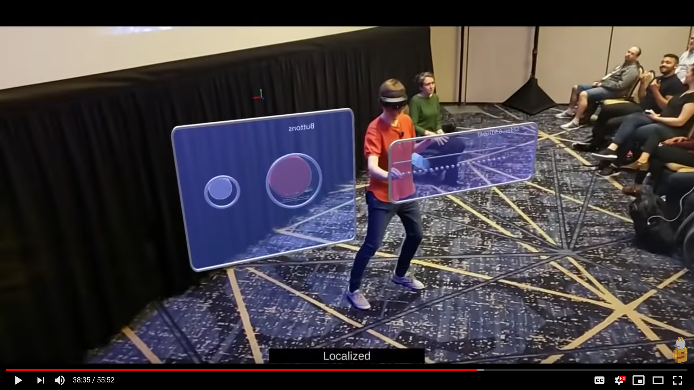
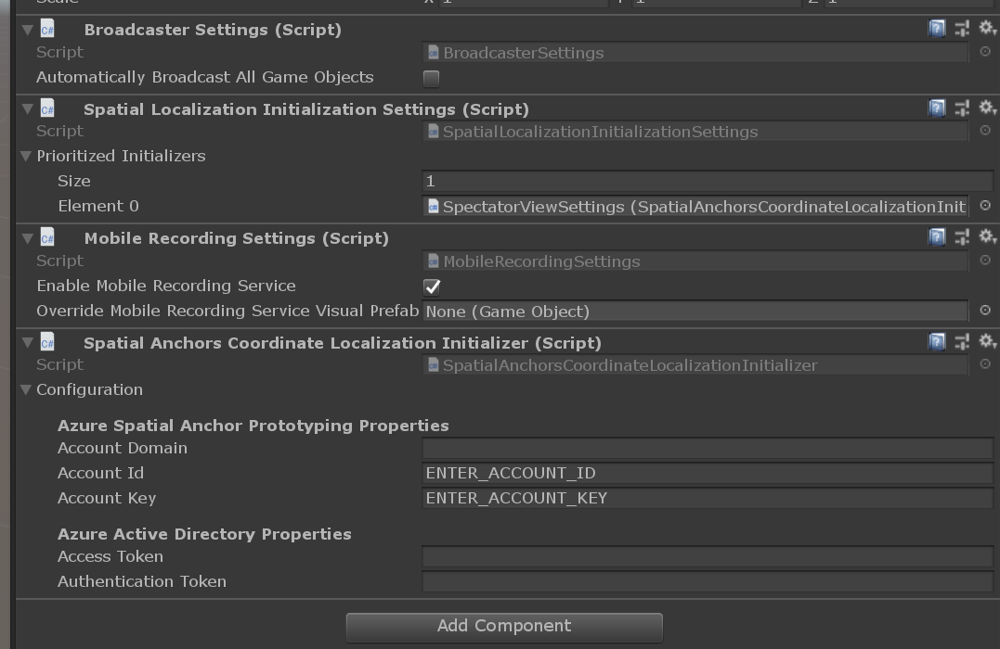
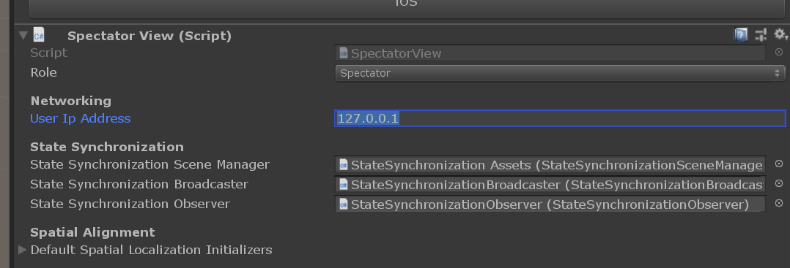

# //BUILD 2019 Demo

This sample of using SpectatorView is very similar to the live code demo presented at //BUILD 2019 conference.

## Running the Demo

In order to run the demo, you will need at least two MR/AR capable devices, with the host device preferably a HoloLens 2. Once you have the devices ready, follow the instructions below.

> **ARKit Note:** If you wish to run the experience on an iOS device with ARKit, download the [ARKit repository](https://bitbucket.org/Unity-Technologies/unity-arkit-plugin/downloads/), unzip it, and copy the contents of the `Unity-Technologies-unity-arkit-plugin-94e47eae5954/Assets` folder to `/samples/Build2019Demo.Unity/Assets/`.

### Instructions

These instructions assumes a HoloLens 2 device for host, and an Android phone for spectator. For iOS, replace references to Android with iOS.

#### Prepare your devices

1. Connect your devices to the same WiFi network.
2. Obtain and write down the host device IP Address.

#### Configure your project

1. Ensure you have created an [Azure Spatial Anchors](https://docs.microsoft.com/en-us/azure/spatial-anchors/quickstarts/get-started-unity-hololens#create-a-spatial-anchors-resource) account.
2. Open the Build2019Demo.Unity project in Unity.
    - If requested, import the TextMeshPro Essentials.
3. Open the [Finished_Scene](Assets/Demo/Scenes/Finished_Scene.unity) sample scene.
3. Open SpectatorView settings by going to the menu `SpectatorView > Edit Settings`. \

4. Replace `ENTER_ACCOUNT_ID` and `ENTER_ACCOUNT_KEY` with appropriate values. \

5. Open `MixedReality-SpectatorView/SpectatorView/Scenes/SpectatorView.Android.unity` find SpectatorView prefab, and override the `User Ip Address` value with the IP of your host device.\

#### Build & Deploy

1. Build UWP Player containing `Demo/Scenes/Finished_Scene.unity` scene, and deploy this application to the HoloLens 2host device.
2. Build Android Player containing `MixedReality-SpectatorView/SpectatorView/Scenes/SpectatorView.Android.unity` scene, and deploy this application to the spectating mobile device.
3. Launch the `SpectatorView.Build2019Demo` on the HoloLens 2 host, and wait for the experience to start.
4. Launch the `SpectatorView.Build2019Demo` on the Android device, and wait for the connection to happen.

> Building iOS version requires an special step after exporting the Unity project to xCode, see the [official instructions](https://docs.microsoft.com/en-us/azure/spatial-anchors/quickstarts/get-started-unity-ios#open-the-xcode-project).

## Sample Project Contents

The demo consists of a simple experience with a buttons panel and a slider, configured for spectation by another device using SpectatorView functionality. The Unity project structure contains:

- **ARKit:** This folder is not checked-in by default, but it's needed to run the experience on ARKit iOS device; see the **ARKit Note** above.
- **AzureSpatialAnchors:** This folder contains the Azure Spatial Anchors (ASA) plugin referenced from the submodule added at `/external/Azure-Spatial-Anchors-Samples/`; the source is hosted on [GitHub](https://github.com/Azure/azure-spatial-anchors-samples).
- **Demo:** Demo assets and prefabs for the simple experience.
- **GoogleARCore:** This folder contains the ARCore SDK referenced from the submodule added at `/external/ARCore-Unity-SDK/`; the source is hosted on [GitHub](https://github.com/google-ar/arcore-unity-sdk).
- **MixedReality-SpectatorView:** Spectator View assets symlinked from `/src/SpectatorView.Unity/Assets`
- **MixedRealityToolkit-Unity:** MixedRealityToolkit-Unity assets symlinked from the common submodule located at `/external/MixedRealityToolkit-Unity/Assets`
- **Plugins:** This folder contains parts of the ASA plugin that need to be in this location.
