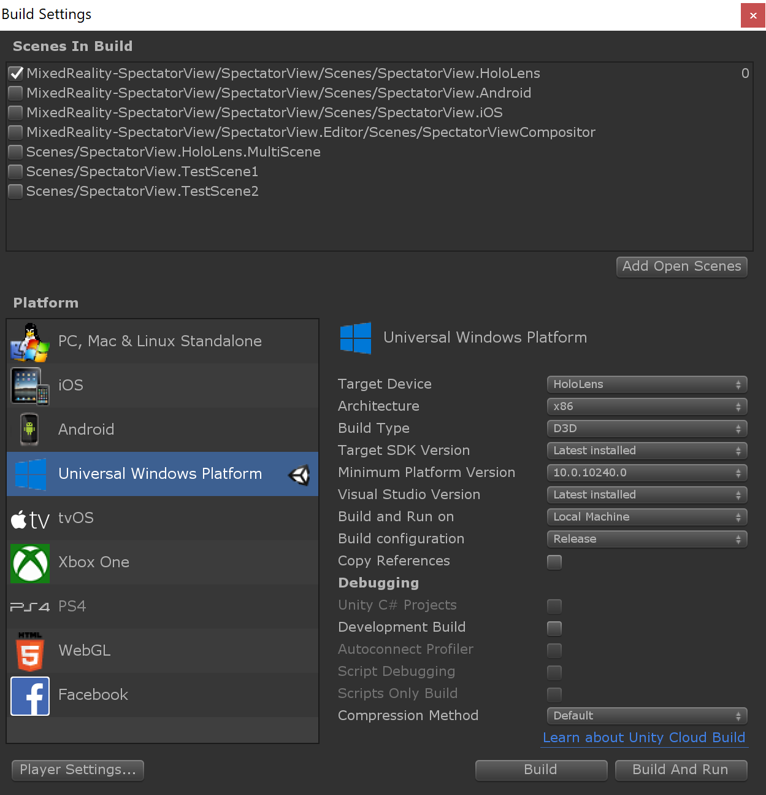
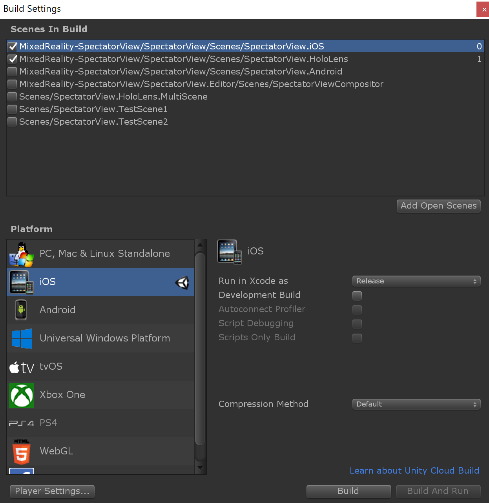

# SpectatorView.Example.Unity

This sample shows how to use [QR Code detection](https://docs.microsoft.com/en-us/windows/mixed-reality/qr-code-tracking) to spatially align devices in the physical world.

## Running the Demo

In order to run the demo, you will need a HoloLens and an AR capable mobile device. Once you have the devices ready, follow the instructions below.

> **ARKit Note:** If you wish to run the experience on an iOS device with ARKit, download the [ARKit repository](https://bitbucket.org/Unity-Technologies/unity-arkit-plugin/downloads/), unzip it, and copy the contents of the `Unity-Technologies-unity-arkit-plugin-94e47eae5954/Assets` folder to `/samples/Build2019Demo.Unity/Assets/`.

### Instructions

These instructions assume that a HoloLens device will be used to host the shared experience and that an Android phone will be used to spectate the shared experience. For iOS, replace references to Android with iOS.

#### Prepare your local codebase

1. Run `tools/Scripts/SetupRepository.bat` (`tools/Scripts/SetupRepository.sh` on Mac) to setup your local version of the code base. This script will obtain the external dependencies required for building this project.
2. If you are using a HoloLens 1 device, build the `SpectatorView.OpenCV.dll` plugin and include it in the SpectatorView.Unity codebase. Instructions for building and adding `SpectatorView.OpenCV.dll` to the Spectator View codebase can be found [here](../../src/SpectatorView.Native/README.md).

#### Prepare your devices

1. Connect your devices to the same WiFi network.
2. Obtain and write down your HoloLens's IP Address (This can be found in the settings menu).

#### Configure your project

1. Open the `SpectatorView.Example.Unity` project in Unity.
2. If building for HoloLens 2, ensure that `QRCODESTRACKER_BINARY_AVAILABLE` has been defined as a Scripting Define Symbols in your WSA Unity Player Settings. If you have made no changes to the SpectatorView.Examples.Unity project definition, this should already be defined (Player settings can be found under `Build Settings -> Player Settings`).
3. If building for HoloLens 1, ensure that `SpectatorView.OpenCV.dll` exists in the project's Assets folder. It should have been placed under Assets\MixedReality-SpectatorView\SpectatorView.Native\Plugins\WSA\x86 when going through the compilation instructions [here](../../src/SpectatorView.Native/README.md).

#### Build & Deploy

##### HoloLens

1. Select `HoloLens` as your target platform using Spectator View's `PlatformSwitcher` (This can be found in the Unity inspector for the `SpectatorView` prefab GameObject).
2. Build UWP Player containing `MixedReality-SpectatorView/SpectatorView/Scenes/SpectatorView.HoloLens` scene, and deploy this application to the HoloLens device.
3. Launch `SpectatorView.Example.Unity` on the HoloLens and wait for the experience to start.

##### Android

1. Select `Android` as your target platform using Spectator View's `PlatformSwitcher` (This can be found in the Unity inspector for the `SpectatorView` prefab GameObject).
2. Include and declare `MixedReality-SpectatorView/SpectatorView/Scenes/SpectatorView.Android.unity` as Scene 0 in your Unity Build Settings.
3. Include and declare `MixedReality-SpectatorView/SpectatorView/Scenes/SpectatorView.HoloLens.unity` as Scene 1 in your Unity Build Settings.
4. `Build and Run` the Android Player through Unity's Build Settings.
5. Launch `SpectatorView.Example.Unity` on the Android device and connect to the HoloLens device by specifying the HoloLens's IP Address.

##### iOS

1. Select `iOS` as your target platform using Spectator View's `PlatformSwitcher` (This can be found in the Unity inspector for the `SpectatorView` prefab GameObject).
2. Include and declare `MixedReality-SpectatorView/SpectatorView/Scenes/SpectatorView.iOS.unity` as Scene 0 in your Unity Build Settings.
3. Include and declare `MixedReality-SpectatorView/SpectatorView/Scenes/SpectatorView.HoloLens.unity` as Scene 1 in your Unity Build Settings.
4. `Build` the iOS Player through Unity's Build Settings.
5. Launch `SpectatorView.Example.Unity` on the iOS device and connect to the HoloLens device by specifying the HoloLens's IP Address.

> Note 1: Additional setup instructions and troubleshooting for spectating with mobile devices can be found [here](../../doc/SpectatorView.Setup.md).

## Sample Project Contents

Once connecting a mobile device to the HoloLens experience, the mobile device should display a rotating, transparent cube that contains a sphere. The HoloLens will show its user an additional object that has been tagged as hidden to the mobile device spectator.

## Troubleshooting

### __Additional Issues__
For more information on troubleshooting other build issues, checkout the `Troubleshooting` section in our detailed setup steps [here](../../doc/SpectatorView.Setup.md).